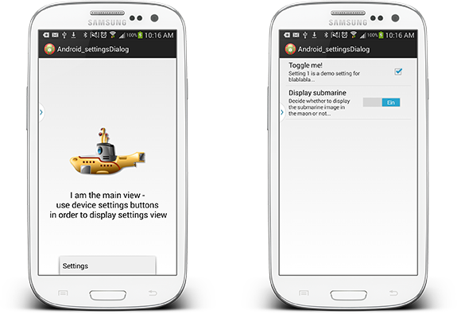
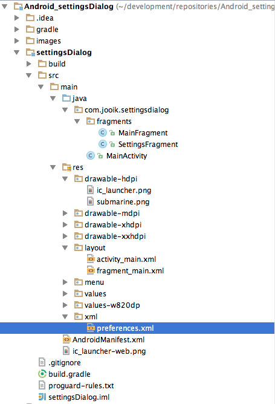

Android_settingsDialog
======================

Disclaimer: application has not been intended to be used for beauty-screen-contest...so figure on the code and not the crappy UI! ;)

Creating Android application will cause you pretty soon to store some global settings, you could do this either your own freestyle Android way (there are many paths...) or the official Android settings way - which is, adding a settings view to your application and the "somehow" setting and applying these properties.

If you know how to do so it's easy...if you dont you will keep struggeling for hours until your first sample keeps running correctly. Notice a view things:

1) it's essentially to have your main view contents in a fragment - if your view is defined in the activity.xml directly the settings menu will always be displayed as an overlay (so the main view is still visible in the background) - until now we did not find a fix for this behavior but it seems FragmentTransactions have diddiculties calling .replace on an activity

2) apply the .addToBackStack to the settings view - this enables you to navigate using Android device buttons...unfortunately a manual hack is required to handle this behavior, this hack is decribed below.

Applying these two little hacks/knowledge will result in a proper working settings application - have fun!



# What do we do here?

In our example we have an image in our main fragment view which can be displaye/hidden using settings property - whao...rocket science! ;)

## Setup main view

As already said, we use a fragment to encapsulated the contents of our main view...so somewhere in your application ther should be around sth like **fragment_main.xml** and **MainFragment.java**:

**fragment_main.xml**
```xml
<FrameLayout xmlns:android="http://schemas.android.com/apk/res/android"
    xmlns:tools="http://schemas.android.com/tools"
    android:layout_width="match_parent"
    android:layout_height="match_parent"
    tools:context="com.jooik.settingsdialog.fragments.MainFragment">

    <LinearLayout
        android:layout_width="fill_parent"
        android:layout_height="fill_parent"
        android:orientation="vertical"
        android:gravity="center"
        android:layout_gravity="center">
        <ImageView
            android:id="@+id/iv_submarine"
            android:layout_width="200dp"
            android:layout_height="200dp"
            android:src="@drawable/submarine"
            android:layout_gravity="center"
            />

        <TextView
            android:layout_width="wrap_content"
            android:layout_height="wrap_content"
            android:textAppearance="?android:attr/textAppearanceLarge"
            android:gravity="center"
            android:text="I am the main view -\nuse device settings buttons\n in order to display settings view"
            android:id="@+id/textView"
            android:layout_gravity="center_horizontal"/>
    </LinearLayout>

</FrameLayout>

```
(Nothin to worry...make sure the ImageView has an ID in order to interact with the view later on)


**MainFragment.java**
```java
public class MainFragment extends Fragment
{
    public MainFragment()
    {
        // Required empty public constructor
    }

    @Override
    public View onCreateView(LayoutInflater inflater, ViewGroup container,
                             Bundle savedInstanceState)
    {
        // Inflate the layout for this fragment
        View view =  inflater.inflate(R.layout.fragment_main, container, false);

        ImageView ivSubmarine = (ImageView)view.findViewById(R.id.iv_submarine);
        // we will do sth with the ImageView later on...
        
        return view;
    }
}

```

## Create Settings screen

In Android there is a pretty simple way of defining a settings screen: simply create a preferences.xml file and add the contents using Android XML elements, there are couple of elements available (Checkbox, Toggle, Text etc.) - see [Android documentation](http://developer.android.com/guide/topics/ui/settings.html)

So add a preferences.xml file to your project and, if necessary the surrounding xml folder - below you can see our example project structure:



Contents of preferences.xml is pretty straightforward: different components, most important thing: each component has a key which can be used to access the property via Preferences-API within our fragment for example.

**preferences.xml**
```xml
<?xml version="1.0" encoding="utf-8"?>
<PreferenceScreen xmlns:android="http://schemas.android.com/apk/res/android">
    <CheckBoxPreference
        android:key="pref_sync"
        android:title="Toggle me!"
        android:summary="Setting 1 is a demo setting for blablabla..."
        android:defaultValue="true" />
    <SwitchPreference
        android:key="display_sub"
        android:title="Display submarine"
        android:summary="Decide whether to display the submarine image in the main view or not..."
        android:defaultValue="false"/>
</PreferenceScreen>
```

You notice property **display_sub**? That's the property we somehow need to reference in order to decide about submarine visibility in our main fragment view.

Finally we need to create a corresponding Java class to the preferences.xml in order to have an accessor enabling us to trigger the settings view...within the adapter the xml is passed in, that's all we have to do here.


**SettingsFragment.java**
```java
public class SettingsFragment extends PreferenceFragment
{
    @Override
    public void onCreate(Bundle savedInstanceState)
    {
        super.onCreate(savedInstanceState);

        // Load the preferences from an XML resource
        addPreferencesFromResource(R.xml.preferences);
    }
}

```

## Trigger & display Settings screen
Ok so let's wake up the settings dialog! Within our MainActivity.java class Android Studio generates by default a hook to get notified in case of device settings menu is pressed - that's exactly the right place to put the call firing up the settings dialog:

```java
@Override
public boolean onOptionsItemSelected(MenuItem item) {
    int id = item.getItemId();
    if (id == R.id.action_settings) {
        getFragmentManager().beginTransaction().replace(R.id.container, new SettingsFragment()).addToBackStack(null).commit();
        inSettings = true;
    }
    return super.onOptionsItemSelected(item);
}
```

The SettingsFragment is initialized and the main view is replaced with the settings dialog. The main view is placed to the backstack, and finally the FragmentTransaction is commited.

And there is this inSettings property - well thats part of the hack required for proper back navigation. The property is used in another method catching the hardware back press, add this method to the MainActivity.java as well:

```java
@Override
public void onBackPressed()
{
    if (inSettings)
    {
        backFromSettingsFragment();
        return;
    }
    super.onBackPressed();
}

private void backFromSettingsFragment()
{
    inSettings = false;
    getFragmentManager().popBackStack();
}
```

So your whole MainActivity.java should by now look similar to the class listed below:

**MainActivity.java**
```java
public class MainActivity extends ActionBarActivity
{
    // ------------------------------------------------------------------------
    // members
    // ------------------------------------------------------------------------

    private boolean inSettings = false;

    // ------------------------------------------------------------------------
    // public usage
    // ------------------------------------------------------------------------

    @Override
    protected void onCreate(Bundle savedInstanceState)
    {
        super.onCreate(savedInstanceState);
        setContentView(R.layout.activity_main);

        if (savedInstanceState == null) {
            getFragmentManager().beginTransaction()
                    .add(R.id.container, new MainFragment())
                    .commit();
        }
    }

    @Override
    public boolean onCreateOptionsMenu(Menu menu)
    {
        
        // Inflate the menu; this adds items to the action bar if it is present.
        getMenuInflater().inflate(R.menu.main, menu);
        return true;
    }

    @Override
    public boolean onOptionsItemSelected(MenuItem item) {
        // Handle action bar item clicks here. The action bar will
        // automatically handle clicks on the Home/Up button, so long
        // as you specify a parent activity in AndroidManifest.xml.
        int id = item.getItemId();
        if (id == R.id.action_settings) {
            getFragmentManager().beginTransaction().replace(R.id.container, new SettingsFragment()).addToBackStack(null).commit();
            inSettings = true;
        }
        return super.onOptionsItemSelected(item);
    }

    @Override
    public void onBackPressed()
    {
        if (inSettings)
        {
            backFromSettingsFragment();
            return;
        }
        super.onBackPressed();
    }

    private void backFromSettingsFragment()
    {
        inSettings = false;
        getFragmentManager().popBackStack();
    }
}

```

## Finally: access property
The nice thing about Android default preferences: yo do not need to care about writing/storing/reading these, as soon as the user toggles a switch the corresponding property will be written automatically...so all you need to do is accessing these properties, for example in your MainFragment.java view initilalization procedure:

(part of the **MainFragment.java** class)
```java
 @Override
public View onCreateView(LayoutInflater inflater, ViewGroup container,
                         Bundle savedInstanceState)
{
    // Inflate the layout for this fragment
    View view =  inflater.inflate(R.layout.fragment_main, container, false);

    ImageView ivSubmarine = (ImageView)view.findViewById(R.id.iv_submarine);

    SharedPreferences sharedPref = PreferenceManager.getDefaultSharedPreferences(getActivity());
    boolean displaySub = sharedPref.getBoolean("display_sub", true);

    if (displaySub)
    {
        ivSubmarine.setVisibility(View.VISIBLE);
    }
    else
    {
        ivSubmarine.setVisibility(View.GONE);
    }

    return view;
}
```

## Conclusion

Ok...you're done - the whole application should work by now including back navigation etc. - stay tuned and dont hesitate to contact us in case of any questions!

[ ](https://twitter.com/_flomueller "Twitter")